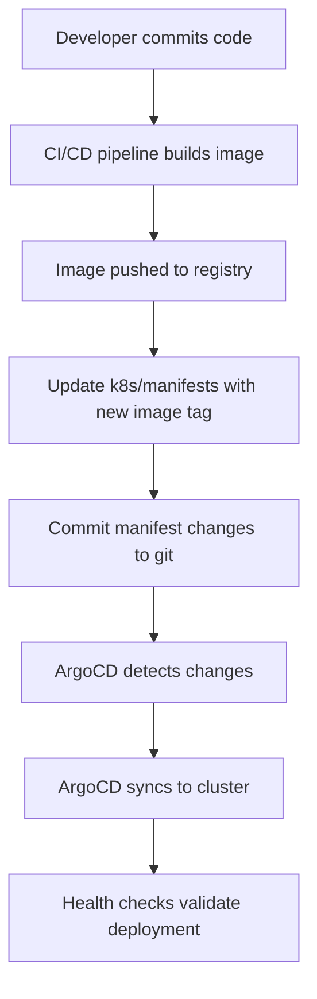
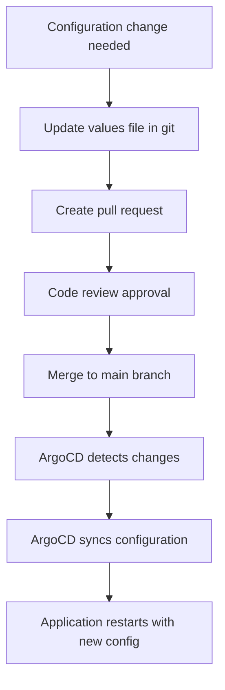
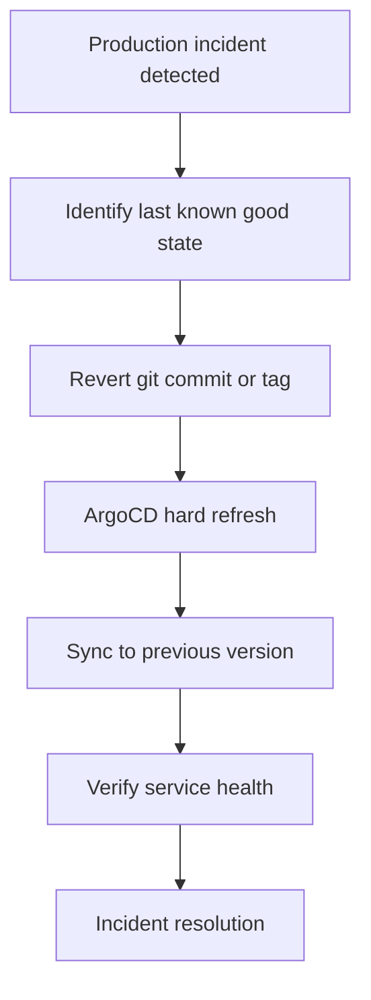

# GitOps Workflow Contract

This document defines the GitOps workflow contracts and procedures for the Traffic Tacos platform using ArgoCD.

## Repository Structure Contract

### Application Repository Structure
Each microservice repository MUST follow this structure:

```
{service-name}/
├── k8s/
│   ├── manifests/           # Kubernetes manifests
│   │   ├── deployment.yaml
│   │   ├── service.yaml
│   │   ├── ingress.yaml
│   │   ├── configmap.yaml
│   │   └── secrets.yaml
│   ├── values-dev.yaml      # Development environment values
│   ├── values-staging.yaml  # Staging environment values
│   ├── values-prod.yaml     # Production environment values
│   └── Chart.yaml           # Helm chart definition (if using Helm)
├── src/                     # Application source code
├── Dockerfile
├── README.md
└── .argocd/                 # ArgoCD-specific configuration
    ├── sync-policy.yaml     # Custom sync policies
    └── health-checks.yaml   # Custom health checks
```

### Configuration Repository (Deployment-Repo)
The central deployment repository structure:

```
deployment-repo/
├── applications/            # ArgoCD Application definitions
│   ├── gateway/
│   │   └── gateway-api.yaml
│   └── tacos/
│       ├── reservation-api.yaml
│       ├── inventory-api.yaml
│       ├── payment-sim-api.yaml
│       └── reservation-worker.yaml
├── projects/               # ArgoCD Project definitions
│   └── traffic-tacos.yaml
├── repositories/           # Repository credential configurations
│   └── github-credentials.yaml
└── environments/          # Environment-specific configurations
    ├── dev/
    ├── staging/
    └── prod/
```

## Deployment Workflow Contract

### 1. Development Workflow


**Requirements**:
- All image tags MUST be immutable (no `latest` tags in production)
- Manifest changes MUST be committed to the same repository as source code
- CI/CD pipeline MUST update image tags in Kubernetes manifests
- All commits MUST include proper commit messages for audit trail

### 2. Configuration Change Workflow


**Requirements**:
- Configuration changes MUST go through pull request review
- Sensitive configuration MUST use Kubernetes secrets
- Environment-specific values MUST be in separate files
- Breaking configuration changes MUST be deployed during maintenance windows

### 3. Emergency Rollback Workflow


**Requirements**:
- Rollback MUST be possible within 5 minutes
- Previous versions MUST be tagged in git
- ArgoCD history MUST retain at least 10 previous revisions
- Post-incident review MUST identify root cause

## Synchronization Policies

### Automatic Sync Policy
```yaml
syncPolicy:
  automated:
    prune: true      # Remove resources not in git
    selfHeal: true   # Revert manual changes
  syncOptions:
    - CreateNamespace=true
    - PrunePropagationPolicy=foreground
    - PruneLast=true
  retry:
    limit: 5
    backoff:
      duration: 5s
      factor: 2
      maxDuration: 3m0s
```

**When to use**:
- ✅ Development and staging environments
- ✅ Production for configuration-only changes
- ✅ Services with comprehensive health checks
- ❌ Database migration deployments
- ❌ Breaking changes requiring coordination

### Manual Sync Policy
```yaml
syncPolicy:
  # automated: disabled - manual sync only
  syncOptions:
    - CreateNamespace=true
  retry:
    limit: 3
    backoff:
      duration: 10s
      factor: 2
      maxDuration: 5m0s
```

**When to use**:
- ✅ Database schema changes
- ✅ Breaking API changes
- ✅ Infrastructure changes
- ✅ Security updates requiring validation

## Branch and Environment Strategy

### Branch Mapping
| Git Branch | Environment | Sync Policy | Purpose |
|------------|-------------|-------------|---------|
| `main` | Production | Manual | Stable releases |
| `staging` | Staging | Automatic | Pre-production testing |
| `develop` | Development | Automatic | Active development |
| `feature/*` | Feature envs | Manual | Feature validation |

### Promotion Process
```
develop → staging → main (production)
```

**Requirements**:
- All changes MUST be tested in development environment first
- Staging environment MUST mirror production configuration
- Production deployments MUST be approved by operations team
- Each promotion MUST update the target revision in ArgoCD Application

## Health Check Contract

### Required Health Endpoints
Each application MUST expose these endpoints:

```yaml
# Kubernetes probes configuration
livenessProbe:
  httpGet:
    path: /health/live
    port: 8080
  initialDelaySeconds: 30
  periodSeconds: 10
  timeoutSeconds: 5
  failureThreshold: 3

readinessProbe:
  httpGet:
    path: /health/ready
    port: 8080
  initialDelaySeconds: 5
  periodSeconds: 5
  timeoutSeconds: 3
  failureThreshold: 3

# ArgoCD custom health check
startupProbe:
  httpGet:
    path: /health/startup
    port: 8080
  initialDelaySeconds: 10
  periodSeconds: 10
  timeoutSeconds: 5
  failureThreshold: 30
```

### Health Check Response Contract
```json
{
  "status": "healthy|unhealthy|degraded",
  "version": "1.2.3",
  "timestamp": "2025-09-25T10:00:00Z",
  "checks": {
    "database": "healthy",
    "cache": "healthy",
    "external_api": "degraded"
  },
  "dependencies": [
    {
      "name": "inventory-api",
      "status": "healthy",
      "latency_ms": 45
    }
  ]
}
```

## Security Requirements

### Repository Access
- Repository credentials MUST be stored as Kubernetes secrets
- SSH keys MUST be used instead of passwords where possible
- Access tokens MUST have minimal required permissions
- Credentials MUST be rotated every 90 days

### RBAC Policies
```yaml
# Example RBAC policy for development team
policy.csv: |
  p, role:dev-team, applications, create, traffic-tacos/*, allow
  p, role:dev-team, applications, update, traffic-tacos/*, allow
  p, role:dev-team, applications, sync, traffic-tacos/*, allow
  p, role:dev-team, applications, get, traffic-tacos/*, allow
  p, role:dev-team, logs, get, traffic-tacos/*, allow
  g, traffic-tacos:developers, role:dev-team
```

### Secret Management
- Application secrets MUST be stored in Kubernetes secrets
- Secrets MUST be encrypted at rest
- Secret rotation MUST be automated where possible
- Secrets MUST NOT be stored in git repositories

## Monitoring and Observability

### Required Metrics
ArgoCD applications MUST expose these metrics:

- `argocd_app_health_status` - Application health status
- `argocd_app_sync_total` - Total number of sync operations
- `argocd_app_sync_duration_seconds` - Duration of sync operations
- `argocd_app_info` - Application metadata

### Required Logs
Applications MUST log these events:

- Sync start/completion events
- Health check status changes
- Configuration drift detection
- Error conditions and recovery

### Alerting Rules
```yaml
# Critical alerts
- alert: ArgocdApplicationOutOfSync
  expr: argocd_app_sync_status != 1
  for: 10m
  labels:
    severity: warning
  annotations:
    summary: "ArgoCD application {{ $labels.name }} is out of sync"

- alert: ArgocdApplicationUnhealthy
  expr: argocd_app_health_status != 1
  for: 5m
  labels:
    severity: critical
  annotations:
    summary: "ArgoCD application {{ $labels.name }} is unhealthy"
```

## Disaster Recovery

### Backup Requirements
- ArgoCD configuration MUST be backed up daily
- Git repositories MUST have mirror backups
- Application state MUST be recoverable from git

### Recovery Procedures
1. **ArgoCD Cluster Failure**: Redeploy ArgoCD from Helm chart, applications will auto-sync
2. **Git Repository Failure**: Switch to mirror repository, update ArgoCD configuration
3. **Application Corruption**: Hard refresh from git, rollback to previous version if needed

### Recovery Time Objectives
- ArgoCD server recovery: 15 minutes
- Application recovery: 10 minutes per application
- Full platform recovery: 30 minutes

This contract ensures consistent, reliable, and secure GitOps operations across the Traffic Tacos platform.